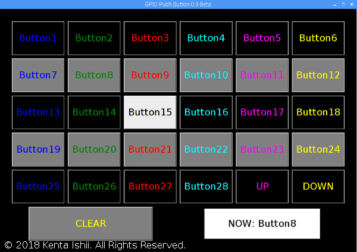

# GPIO Push Button

License: BSD-3-Clause

**PURPOSE**



* GPIO Push Button is a series of GUI buttons aimed to use for Kenta Ishii's project on Raspberry Pi (RasPi), [Aloha Operating System](https://github.com/JimmyKenMerchant/RaspberryPi).

* Some of my projects in Aloha Operating System are aiming to make RasPi act like dedicated IC such as Sound Box, Synthesizer, LED Driver nicknamed "Coconut". Interfaces on Coconuts are 5-bit parallel (GPIO22-25) which 31 commands can be selected. To debug the RasPi projects, I build GPIO Push Button which is coded by Python 3.

**USAGE**

* Connecting Type #1 (Direct): Connect output pins (on RasPi with Raspbian) and input pins (on RasPi with Coconut). Make sure to connect GND on each RasPi because the difference of voltage on each GND makes incorrect detecting logical high or low.

: RasPi 2B with Raspbian for GPIO Push Button and RasPi Zero W with Aloha Operating System Bridged by A Breadboard")

* Connecting Type #2 (Clock): GPIO13 is Clock Out. Clock Out outputs high state regularly. If any button is pushed, Clock Out goes low state, and other pins output status of buttons before Clock Out goes back high state. The latest version of Coconuts uses this clock for synchronization. The time of delay for Clock Out can be defined as the first argument.

* Clone my project and run the python file in a terminal of Raspbian. Installing Git is needed in advance.

```bash
cd ~/Desktop
git clone https://github.com/JimmyKenMerchant/Python_Code
cd Python_Codes/gpio_pbutton
chmod u+x gpio_pbutton.py
# Time of Delay for Clock is 10 Milliseconds
./gpio_pbutton.py 0.01
```

* Push a button. Pins assigned by the button output high state. If you push Button1, GPIO16 (Bit[0]) outputs high state. If you push Button3, GPIO16 (Bit[0]) and GPIO19 (Bit[1]) output high state. If you push Button21, GPIO16 (Bit[0]) and GPIO20 (Bit[2]) and GPIO26 (Bit[4]) output high state. These behaviors are the same as decimal-to-binary conversion, e.g., Decimal 21 is binary 10101 (Bit[0,2,4]).

**OUTPUT**

* GPIO13 as Clock Out

* GPIO16 as Bit[0]

* GPIO19 as Bit[1]

* GPIO20 as Bit[2]

* GPIO21 as Bit[3]

* GPIO26 as Bit[4]

**COMPATIBILITY**

* Raspbian GNU/Linux 10 (buster) and Python 3.7.3

* Raspbian GNU/Linux 9.4 (stretch) and Python 3.5.3
