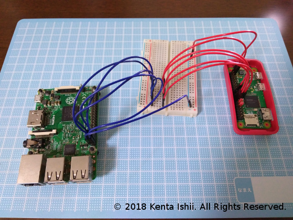

# GPIO Push Button

License: BSD-3-Clause

**PURPOSE**


* GPIO Push Button is GUI buttons aimed to use for Kenta Ishii's project on Raspberry Pi (RasPi), "Aloha Operating System".

* Some of my projects in "Aloha Operating System" are aiming to make RasPi act like dedicated IC such as Sound Box, Synthesizer, LED Driver called "Coconut". Interfaces on Coconuts are 5-bit parallel (GPIO22-25) which 31 commands can be selected. To debug the RasPi projects, I build GPIO Push Button which is coded by Python 3.

**USAGE**

* Type #1 (Direct): Connect output pins (on RasPi with Raspbian) and input pins (on RasPi with Coconut). Make sure to connect GND on each RasPi because the difference of voltage on each GND makes incorrect detecting logical high or low.



* Type #2 (Through Clock): If you want synchronized timing of detecting logical high on input pins, use clock generated from Coconut. To use clock, apply Enhancement-mode N-channel MOSFETs. Connect output pins to each gate, clock to each drain, input pins to each source.

```bash
cd ~/Desktop
git clone https://github.com/JimmyKenMerchant/Python_Code
cd Python_Codes/gpio_pbutton
chmod u+x gpio_pbutton.py
./gpio_pbutton.py
```

* Push a button. Pins assigned by the button output voltage. If you push Button1, GPIO16 (Bit[0]) outputs voltage. If you push Button3, GPIO16 (Bit[0]) and GPIO19 (Bit[1]) output voltage. If you push Button21, GPIO16 (Bit[0]) and GPIO20 (Bit[2]) and GPIO26 (Bit[4]) output voltage. These behaviors are the same as decimal-to-binary conversion, e.g., Decimal 21 is Binary 10101 (Bit[0,2,4]).

**OUTPUT**

* GPIO16 as Bit[0]

* GPIO19 as Bit[1]

* GPIO20 as Bit[2]

* GPIO21 as Bit[3]

* GPIO26 as Bit[4]

**COMPATIBILITY**

* Raspbian GNU/Linux 9.4 (stretch) and Python 3.5.3
